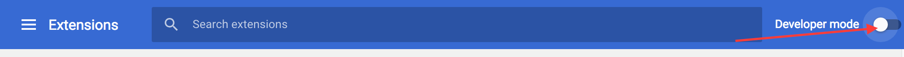

* [Installation](#installation)

## Installation

* Clone this project to a local directory, for example `~\Documents\`

```
cd ~/Documents
git clone git@github.com:PMET-public/magento-cloud-extension.git
```

* Open Chrome and visit the following url:

```
chrome://extensions/
```

* Enable Developer mode:

<center></center>

* Load unpacked extension from cloned directory, for example from `~\Documents\magento-cloud-extension\app\`:

<center></center>

* Magento Cloud Extension should now be visible:

<center></center>

