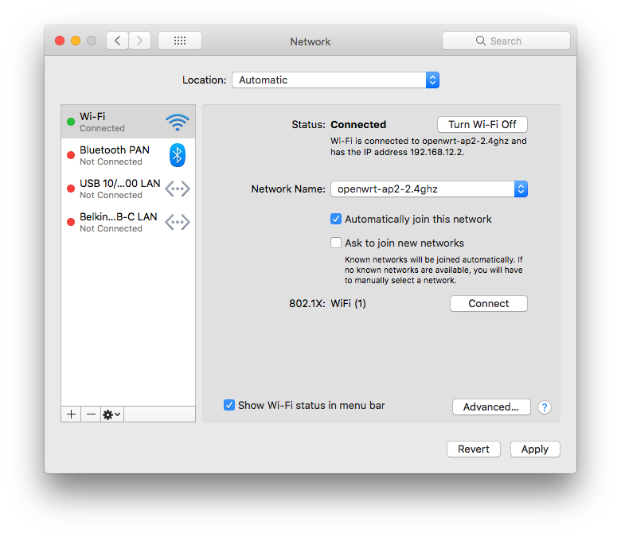
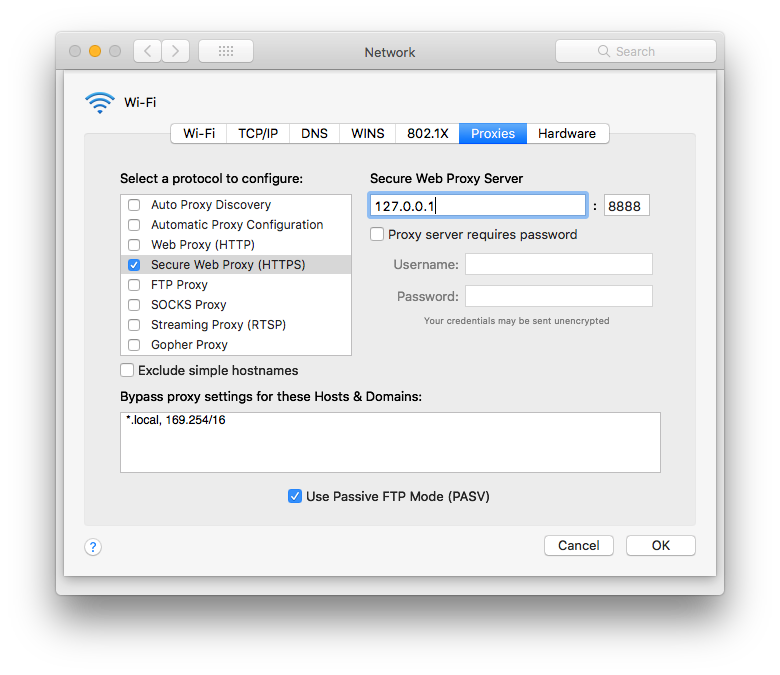

# How to configure browser access through the proxy

Open the Network preferences pane from your system preferences

Highlight the top `Connected` service on the left. Then click `Advanced...` in the bottom right.

Next click `Proxies` in the menu bar.

Check `Secure Web Proxy (HTTPS)` and enter `127.0.0.1` and `8888` as shown.

Then click `OK` followed by `Apply`

When done, click `Advanced` again, uncheck the proxy setting, folloed by `OK` & `Apply`
